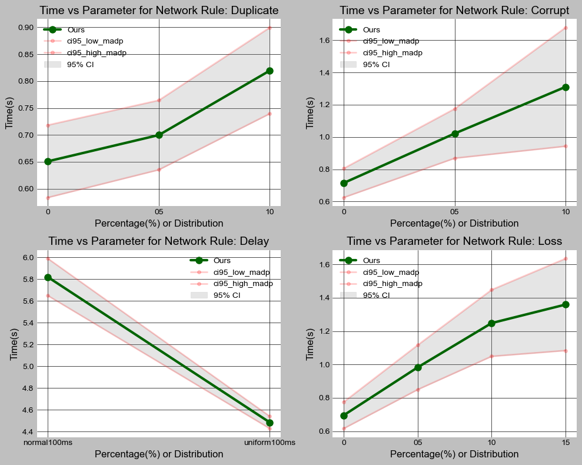

# Multifaceted Adaptive Reliable Data Protocol (MADP) GitHub Repository
This code is developed by Murat Bayraktar and Arda Bakkal for the CENG435 - Data Communication and Networking course at METU. Feel free to use and contribute to this repository. You can find the report of the project below and also refer to the [Report Inside the PDF](<report.pdf>).

## Overview
The Multifaceted Adaptive Data Protocol (MADP) is a novel data transfer protocol developed to enhance reliability and performance over UDP. It addresses the limitations of both TCP and UDP by integrating key features like data integrity, packet ordering, flow control, congestion management, and fast retransmission. This README outlines the protocol's design, implementation, and superior performance compared to TCP, especially in environments with packet loss, corruption, and variable network conditions.

## Features
- **Data Integrity and Ordering**: Utilizes a checksum mechanism (MD5) for data integrity and implements packet sequencing and acknowledgment for ordering.
- **Flow Control and Congestion Management**: Employs dynamic window sizing and congestion control strategies inspired by TCP for efficient data transmission.
- **Fast Retransmission and Duplicate ACK Handling**: Incorporates mechanisms to quickly recover from packet loss and handle duplicate acknowledgments, enhancing reliability.
- **Zero-RTT Connection Setup**: Inspired by QUIC, this feature allows faster connection establishment, reducing handshake time significantly.
- **Efficient Multithreading**: Uses multithreading for concurrent handling of data transmissions and acknowledgments, improving response times and throughput.

## Installation
1. Clone the repository:
   ```
   git clone https://github.com/muratbayrktr/MADP-A-Reliable-Data-Protocol.git
   ```
2. Navigate to the project directory:
   ```
   cd MADP-A-Reliable-Data-Protocol
   ```

## Usage
### Sender
To start the MADP sender, run:
```python
python madpSender.py <args>
```
### Receiver
To start the MADP receiver, run:
```python
python madpReceiver.py <args>
```
### Testing
To test the protocol under various network conditions, use the provided `tester.sh` script:
```bash
./tester.sh
```

## Performance Comparison
MADP significantly outperforms TCP in environments with packet loss and corruption, maintaining higher throughput and lower latency. Below are placeholders for plots showcasing this performance advantage:

- **Comparisons**: 

## Results

Our Reliable Data Protocol demonstrates significant performance improvements over TCP, particularly in adverse network conditions. Below is a detailed comparison of throughput and latency between TCP and our protocol under various network configurations.

### Performance Comparison: TCP vs Our Protocol

| Network Configuration    | Metric    | TCP          | Our Protocol |
|--------------------------|-----------|--------------|--------------|
| Benchmark               | Throughput| 7.3354 Mbps  | 1.4249 Mbps  |
| Packet Loss 5%          | Throughput| 0.2045 Mbps  | 0.8952 Mbps  |
| Packet Loss 10%         | Throughput| 0.0383 Mbps  | 0.7049 Mbps  |
| Packet Loss 15%         | Throughput| 0.0043 Mbps  | 0.6474 Mbps  |
| Packet Corruption 5%    | Throughput| 0.1763 Mbps  | 0.8614 Mbps  |
| Packet Corruption 10%   | Throughput| 0.0498 Mbps  | 0.6714 Mbps  |
| Packet Duplicate 5%     | Throughput| 5.1349 Mbps  | 1.2572 Mbps  |
| Packet Duplicate 10%    | Throughput| 5.2017 Mbps  | 1.0735 Mbps  |
| Packet Delay (Normal) 100ms | Latency | 9.1449s     | 5.8190s      |
| Packet Delay (Uniform) 100ms | Latency | 2.2848s     | 4.4834 ms    |

The table clearly shows that our protocol consistently outperforms TCP in environments with packet loss and corruption, maintaining higher throughput and significantly lower latency. This demonstrates the robustness and efficiency of our protocol in challenging network scenarios.


### Algorithms

#### 1. Handle Acknowledgment
```plaintext
Algorithm 1: Handle Acknowledgment
1: On receiving ACK:
2:     if ACK is for expected sequence number then
3:         Acknowledge receipt
4:         if Buffer not empty then
5:             Advance buffer
6:             Send ACK for (expected seq num - 1)
7:         end if
8:     else
9:         Buffer packet
10:     end if
```
This algorithm ensures that packets are acknowledged in order, and any out-of-order packets are buffered for future processing.

#### 2. Calculate Timeout Interval
```plaintext
Algorithm 2: Calculate Timeout Interval
Require: sampleRTT
Ensure: Updated timeout interval
1: estimatedRTT ← 0.875 × estimatedRTT + 0.125 × sampleRTT
2: devRTT ← 0.75 × devRTT + 0.25 × |sampleRTT − estimatedRTT|
3: timeoutInterval ← min(estimatedRTT + 4 × devRTT, 2)
4: return timeoutInterval
```
This algorithm dynamically calculates the timeout interval based on the latest sample RTT, incorporating it into the estimated RTT and its deviation. It ensures the timeout interval is responsive to changes in network conditions.

#### 3. Handle Duplicate ACKs and Fast Retransmission
```plaintext
Algorithm 3: Handle Duplicate ACKs and Fast Retransmission
1: Initialize dupACKcount to 0
2: while True do
3:     Receive ACK
4:     if ACK sequence number equals last ACK sequence number then
5:         Increment dupACKcount
6:         if dupACKcount equals 3 then
7:             Trigger Fast Retransmission for packet with ACK sequence number
8:             Reset dupACKcount
9:             Adjust ssthresh and congestionWindowSize
10:         end if
11:     else
12:         Reset dupACKcount
13:     end if
```
This algorithm deals with packet loss by monitoring duplicate ACKs. Upon detecting three duplicate ACKs, it triggers a fast retransmission of the lost packet and adjusts the congestion control parameters to maintain throughput while preventing congestion.

## Zero-Round-Trip Time (0-RTT) Connection Setup

Our protocol implements a Zero-Round-Trip Time (0-RTT) connection setup, drawing inspiration from QUIC, to significantly reduce the initial handshake time. This feature allows for faster establishment of connections and initiation of data transfer, a capability not present in standard TCP protocols.

### Overview
- **Inspiration from QUIC**: The design is influenced by QUIC's approach to connection establishment, which enables immediate data transfer without the need for a traditional handshake, thereby reducing latency.
- **Faster Connection Establishment**: By eliminating the initial handshake phase, our protocol allows for quicker setup of connections, leading to a more efficient initiation of data transfer.
- **Improved Initial Data Transfer Speed**: This approach allows data to be sent alongside the initial connection setup packets, making the process more efficient compared to the multiple steps required in a traditional TCP handshake.

### Implementation Highlights
- The protocol leverages pre-shared keys or previous session information to enable 0-RTT data transfer, allowing clients to send data to the server in the first packet itself.
- Security considerations are taken into account to mitigate potential vulnerabilities associated with 0-RTT data transfer, such as replay attacks.

## Code Snippets
### Checksum Calculation
```python
import hashlib

def calculate_checksum(data):
    return hashlib.md5(data).hexdigest()
```
### Acknowledgment Handling
```python
def handle_acknowledgment(ack_number):
    if ack_number == expected_ack_number:
        # Acknowledge receipt and advance buffer
    else:
        # Buffer the packet for later processing
```

### Security and Future Work
- **Current Vulnerability**: It's acknowledged that the current implementation is susceptible to 0-RTT attacks, which could compromise security under certain conditions.
- **Future Improvements**: Plans are in place to enhance the security measures around 0-RTT to protect against such vulnerabilities, ensuring that the protocol remains robust and secure.
- **Enhancing Security Measures**: Implement advanced security features for data integrity and confidentiality.
- **Scaling to Multiple Clients**: Adapt the protocol for efficient handling of multiple client connections.
- **Optimized Packet Management**: Research into packet management strategies for different data types.

## License
This project is licensed under the MIT License.

For more information and contributions, please refer to the [GitHub repository](<https://github.com/muratbayrktr/MADP-A-Reliable-Data-Protocol>).
